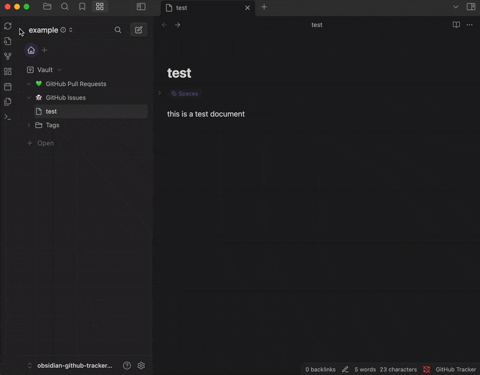

# GitHub Tracker for Obsidian

An Obsidian plugin that integrates with GitHub to track issues and pull requests directly in your vault.



## Features

-   Track issues and pull requests from specific GitHub repositories
-   Automatically sync GitHub data on Obsidian startup (configurable)
-   Filter tracked items by assignee and reviewers
-   Create Markdown notes for each issue or pull request

## Installation

### From Obsidian Community Plugins

(Note it is not yet available in the community plugins list)

1. Open Obsidian Settings
2. Go to "Community Plugins"
3. Click "Browse" and search for "GitHub Tracker"
4. Click "Install" and then "Enable"

### Manual Installation

1. Download the latest release from the [GitHub releases page](https://github.com/schaier-io/obsidian-github-tracker-plugin/releases)
2. Extract the files to your vault's plugins folder: `<vault>/.obsidian/plugins/github-tracker/`
3. Reload Obsidian
4. Enable the plugin in Obsidian settings under "Community Plugins"

## Getting Started

### Setting up a GitHub Personal Access Token

1. Create a GitHub personal access token:

    - Go to [GitHub Settings > Developer Settings > Personal access tokens](https://github.com/settings/tokens)
    - Create a new token with the `repo` permission scope. Limit the token to the minimum permissions needed. For more information. Requirements are READ for Issues, Pull Requests on wanted Repositories. Read more [here](https://docs.github.com/en/authentication/keeping-your-account-and-data-secure/creating-a-personal-access-token)
    - Copy the generated token

2. Configure the plugin:
    - Open the GitHub Tracker settings tab in Obsidian
    - Paste your GitHub access token in the "GitHub Token" field
    - Configure other settings as desired

### Adding Repositories to Track

1. In the GitHub Tracker settings, scroll to the "Repositories" section
2. Click "Add" and choose either:
    - "Manual Entry" to add a repository by owner/name format
    - "From GitHub" to select from your accessible repositories
3. Configure which items to track (issues, pull requests)
   (_optionally_) limit the issues and pull requests to track by assignee and/or reviewer

## Configuration Options

### General Settings

-   **GitHub Token**: Your personal access token for GitHub API access
-   **Sync on Startup**: Automatically sync data when Obsidian starts
-   **Sync Notice Mode**: Control the verbosity of notifications during sync
-   **Content Escape Mode**: Security setting for how to handle content from GitHub

### Repository-Specific Settings

For each tracked repository, you can configure:

-   **Issues Tracking**:
    -   Enable/disable tracking
    -   Folder location for issue notes
    -   Filter by assignee
    -   Set defaults on when to update or delete the issue notes
-   **Pull Request Tracking**:
    -   Enable/disable tracking
    -   Folder location for PR notes
    -   Filter by assignee and/or reviewer
    -   Set defaults on when to update or delete the PR notes

## Note Structure

GitHub Tracker creates standardized Markdown notes for each tracked item:
_You can edit the properties 'updateMode' and 'allowDelete' in the note to change the behavior of the plugin for this specific note._

### Issue Notes

```markdown
---
title: "Issue Title"
status: "open"
created: "2023-01-01T00:00:00Z"
url: "https://github.com/owner/repo/issues/42"
assignees: [username]
updateMode: "none|update|append"
allowDelete: true|false
---

# Issue Title

Issue description and content from GitHub...
```

### Pull Request Notes

```markdown
---
title: "PR Title"
status: "open"
created: "2023-01-01T00:00:00Z"
url: "https://github.com/owner/repo/pull/43"
assignees: [username]
requested_reviewers: [reviewer1, reviewer2]
updateMode: "none|update|append"
allowDelete: true|false
---

# PR Title

Pull request description and content from GitHub...
```

## Commands

GitHub Tracker adds the following commands to Obsidian:

-   **Sync GitHub Issues & Pull Requests**: Manually trigger synchronization

## Security Considerations

The plugin offers several content escaping options for added security:

-   **Normal Mode**: Escapes potentially dangerous characters which are used by other plugins like Templater, Dataview, etc. (recommended)
-   **Strict Mode**: Only allows alphanumeric characters and basic punctuation including links.
-   **Very Strict Mode**: Most restrictive, only alphanumeric and minimal punctuation
-   **Disabled**: No escaping (use with caution)

Please report any issues you encounter to the [GitHub Issues](https://github.com/schaier-io/obsidian-github-tracker-plugin/issues) page.

**Note:** While following best practices and ensuring safety as best as possible. This plugin is not responsible for any issues that may occur from using its features. It is your responsibility to ensure that the content you are syncing is safe and does not contain any malicious content. Especially if using Plugins that enable script execution.

## Customization

### CSS Customization

The plugin uses CSS variables for consistent styling. You can customize the appearance by adding rules to your Obsidian CSS snippets. For details see the [styles.css](styles.css) file.

## New Features

You found something that is missing?

You can create a new issue or pull request on the [GitHub repository](https://github.com/schaier-io/obsidian-github-tracker-plugin/issues)

I am happy to add new features and bug fixes. If you have any other questions or feedback, please also let me know.

In case you want to quickly add it yourself, contributions are welcome :)

## Developing

If you want to contribute to the plugin:

1. Clone the repository
2. Install dependencies with `npm install`
3. Use `npm run dev` to start the compilation in watch mode
4. Make your changes
5. Use `npm run build` to create a production build

## Troubleshooting

### Common Issues

1. **GitHub API Rate Limit Exceeded**

    - GitHub has API rate limits that may affect sync operations
    - Consider reducing sync frequency or limiting the number of tracked repositories

2. **Authentication Failures**

    - Ensure your GitHub token has the correct permissions
    - Try generating a new token if issues persist

3. **Content Not Updating**
    - Check you added the repository to track in the GitHub Tracker settings and enabled tracking for issues and/or pull requests
    - Verify your repository access permissions on GitHub

## Release Notes

See the [CHANGELOG.md](https://github.com/schaier-io/obsidian-github-tracker-plugin/blob/master/CHANGELOG.md) file for details about each release.

## Support

-   [GitHub Issues](https://github.com/schaier-io/obsidian-github-tracker-plugin/issues): For bug reports and feature requests

## License

This project is licensed under the MIT License - see the [LICENSE](LICENSE) file for details.

## Acknowledgements

-   [Obsidian](https://obsidian.md/) for the amazing knowledge management tool
-   [GitHub API](https://docs.github.com/en/rest) for providing access to repository data
